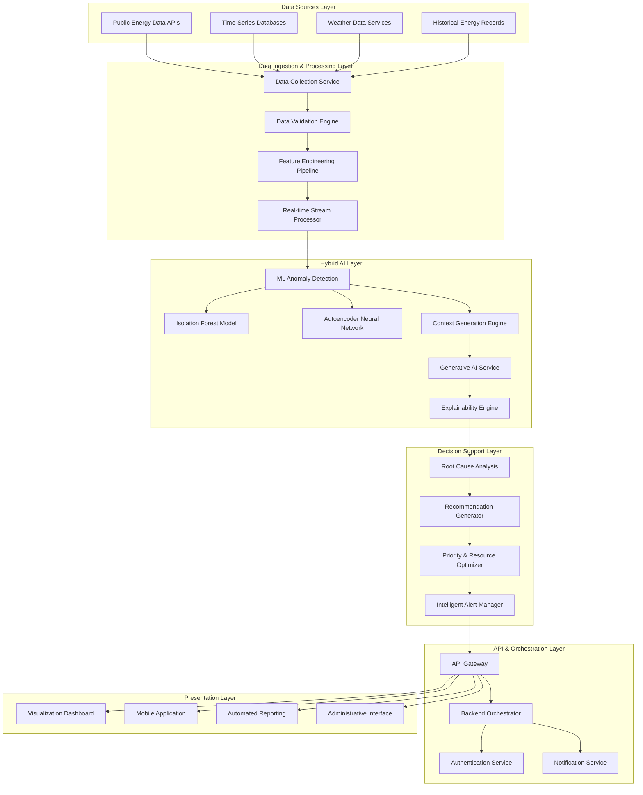

# Design Document: AI-Powered Anomaly Detection and Decision Support for Energy-Efficient Rural Infrastructure

## Project Overview

The AI-Powered Anomaly Detection and Decision Support System is a comprehensive hackathon project that revolutionizes energy management in rural infrastructure through a hybrid AI approach. This system combines traditional machine learning for anomaly detection with generative AI for explainable insights and actionable recommendations, specifically designed for energy-efficient rural infrastructure deployment.

The project addresses the critical challenge of power supply inefficiencies in rural areas by providing real-time monitoring, intelligent anomaly detection, root cause analysis, and human-centered explainable insights. The system processes public time-series energy consumption data to detect anomalies and leverages Generative AI to provide contextual explanations and decision support for infrastructure managers, grid operators, and maintenance teams.

## Problem Statement

Rural energy infrastructure faces unique challenges that traditional monitoring systems fail to address effectively:

1. **Limited Technical Expertise**: Rural areas often lack specialized personnel to interpret complex technical data and make informed decisions about power grid anomalies
2. **Resource Constraints**: Limited budgets and maintenance resources require precise prioritization of interventions
3. **Infrastructure Vulnerability**: Rural power grids are more susceptible to environmental factors and equipment failures due to geographic isolation
4. **Data Interpretation Gap**: Existing systems detect anomalies but fail to provide actionable insights that non-technical stakeholders can understand and act upon
5. **Reactive Maintenance**: Current approaches are primarily reactive, leading to extended outages and higher costs

## Goals and Objectives

### Primary Goals
- **Intelligent Anomaly Detection**: Implement ML-based anomaly detection using public time-series energy consumption data with 95%+ accuracy
- **Explainable AI Integration**: Provide human-readable explanations for detected anomalies using generative AI
- **Actionable Decision Support**: Generate prioritized, resource-aware recommendations for infrastructure maintenance and optimization
- **Rural-Optimized Deployment**: Design for low-infrastructure environments with intermittent connectivity and limited technical resources

### Secondary Objectives
- **Sustainability Focus**: Optimize energy efficiency and reduce waste through predictive insights
- **Multi-Stakeholder Support**: Serve different user roles (managers, operators, technicians) with tailored interfaces
- **Scalable Architecture**: Enable deployment across multiple rural regions with centralized management
- **Cost-Effective Solutions**: Minimize operational costs through intelligent resource allocation and preventive maintenance

The system architecture follows a modular approach with three core components: a traditional ML-based Anomaly Detection Engine, a Root Cause Analysis Engine, and a GenAI-powered Insight Generation Engine. These components work together to process public energy consumption data, identify anomalies, determine root causes, and generate actionable recommendations in natural language.

## System Architecture

### High-Level Architecture

The system follows a layered, microservices architecture optimized for rural deployment with hybrid AI capabilities:



### Component-Level Architecture

#### Data Ingestion & Processing Components
- **Data Collection Service**: Aggregates public time-series energy data from multiple sources
- **Data Validation Engine**: Ensures data quality and handles missing or corrupted data points
- **Feature Engineering Pipeline**: Extracts relevant features for anomaly detection (statistical measures, temporal patterns, seasonal adjustments)
- **Real-time Stream Processor**: Handles continuous data streams with low-latency processing

#### Hybrid AI Components
- **ML Anomaly Detection Engine**: Implements multiple algorithms (Isolation Forest, Autoencoder) for robust anomaly detection
- **Context Generation Engine**: Converts numeric anomalies into contextual information for GenAI processing
- **Generative AI Service**: Processes contextual anomaly data to generate human-readable explanations
- **Explainability Engine**: Ensures AI decisions are transparent and interpretable

#### Decision Support Components
- **Root Cause Analysis**: Correlates anomalies with historical patterns, weather data, and infrastructure status
- **Recommendation Generator**: Creates actionable recommendations based on analysis results
- **Priority & Resource Optimizer**: Prioritizes actions based on impact, urgency, and available resources
- **Intelligent Alert Manager**: Manages multi-channel notifications with role-based filtering

## Detailed Workflow

### 1. Data Ingestion Workflow
```
Public Energy APIs → Data Collector → Validation → Feature Engineering → Stream Processing
```

**Process Steps**:
1. **Data Collection**: Automated collection from public time-series energy consumption APIs
2. **Data Validation**: Quality checks, outlier detection, and missing data handling
3. **Feature Engineering**: Extract statistical features, temporal patterns, and seasonal adjustments
4. **Stream Processing**: Real-time data processing with configurable batch sizes

### 2. Data Preprocessing & Feature Engineering
```
Raw Time-Series → Statistical Features → Temporal Patterns → Seasonal Adjustments → ML-Ready Dataset
```

**Feature Categories**:
- **Statistical Features**: Mean, variance, skewness, kurtosis over sliding windows
- **Temporal Features**: Hour-of-day, day-of-week, seasonal patterns
- **Trend Features**: Moving averages, rate of change, acceleration
- **Comparative Features**: Deviation from historical norms, peer comparisons

### 3. Anomaly Detection Using ML Models
```
Preprocessed Data → Isolation Forest → Autoencoder → Ensemble Scoring → Anomaly Classification
```

**ML Pipeline**:
1. **Isolation Forest**: Detects anomalies by isolating observations through random feature selection
2. **Autoencoder**: Neural network approach for detecting reconstruction errors in normal patterns
3. **Ensemble Scoring**: Combines multiple model outputs for robust anomaly detection
4. **Classification**: Categorizes anomalies by severity (Low, Medium, High, Critical)

### 4. Context Generation from Numeric Anomalies
```
Numeric Anomalies → Context Enrichment → Metadata Addition → Structured Context → GenAI Input
```

**Context Enhancement**:
- **Temporal Context**: Time of occurrence, duration, frequency
- **Magnitude Context**: Severity level, deviation from normal
- **Environmental Context**: Weather conditions, seasonal factors
- **Historical Context**: Similar past events, resolution outcomes

### 5. Generative AI Layer for Explanation and Decision Support
```
Structured Context → GenAI Processing → Natural Language Generation → Role-Based Adaptation → Human-Readable Insights
```

**GenAI Processing Pipeline**:
1. **Context Analysis**: Understanding anomaly characteristics and implications
2. **Explanation Generation**: Creating clear, non-technical explanations
3. **Recommendation Synthesis**: Generating actionable recommendations
4. **Role-Based Adaptation**: Tailoring language and detail level for different user types

### 6. Backend API Orchestration
```
Frontend Requests → API Gateway → Authentication → Service Routing → Response Aggregation → Client Response
```

**API Orchestration Features**:
- **Request Routing**: Intelligent routing to appropriate microservices
- **Response Aggregation**: Combining data from multiple services
- **Caching Strategy**: Optimized caching for rural low-bandwidth environments
- **Rate Limiting**: Protecting services from overload

### 7. Frontend Visualization Dashboard
```
API Data → Dashboard Components → Role-Based Views → Interactive Visualizations → Export Capabilities
```

**Dashboard Features**:
- **Real-time Monitoring**: Live anomaly detection and system status
- **Historical Analysis**: Trend visualization and pattern recognition
- **Interactive Maps**: Geographic visualization of rural infrastructure
- **Customizable Alerts**: User-configurable notification preferences

## Technology Stack

### Backend Technologies
- **Programming Language**: Python 3.9+ (primary), Node.js (API Gateway)
- **ML/AI Frameworks**: 
  - scikit-learn (Isolation Forest)
  - TensorFlow/PyTorch (Autoencoder neural networks)
  - Transformers library (Hugging Face) for GenAI
- **Data Processing**: 
  - Apache Kafka (stream processing)
  - Pandas/NumPy (data manipulation)
  - Apache Airflow (workflow orchestration)
- **Databases**:
  - InfluxDB (time-series data)
  - PostgreSQL (relational data)
  - Redis (caching and session management)

### Frontend Technologies
- **Framework**: React.js with TypeScript
- **Visualization**: D3.js, Chart.js, Mapbox GL JS
- **UI Components**: Material-UI or Ant Design
- **State Management**: Redux Toolkit
- **Mobile**: React Native (cross-platform mobile app)

### Infrastructure & Deployment
- **Cloud Platform**: AWS/Azure/GCP (multi-cloud support)
- **Containerization**: Docker, Kubernetes
- **API Gateway**: Kong or AWS API Gateway
- **Monitoring**: Prometheus, Grafana, ELK Stack
- **CI/CD**: GitHub Actions, Jenkins

### AI/ML Infrastructure
- **Model Serving**: MLflow, TensorFlow Serving
- **Feature Store**: Feast or custom solution
- **GenAI Services**: OpenAI API, Anthropic Claude, or local LLM deployment
- **Vector Database**: Pinecone or Weaviate (for semantic search)

### Security & Compliance
- **Authentication**: OAuth 2.0, JWT tokens
- **Encryption**: TLS 1.3, AES-256
- **Secrets Management**: HashiCorp Vault
- **Compliance**: SOC 2, ISO 27001 frameworks

## Components and Interfaces
### Data Ingestion Service
**Purpose**: Collects and validates public time-series energy consumption data from multiple sources including government APIs, utility databases, and weather services.

**Key Interfaces**:
- `ingestPublicEnergyData(api_endpoint, timestamp_range, region_id)`: Processes public energy consumption data
- `validateDataQuality(data_batch)`: Ensures data integrity and flags quality issues
- `normalizeTimeSeriesData(raw_data, source_type)`: Converts data to standardized time-series format

**Implementation Notes**: Uses Apache Kafka for high-throughput data streaming and implements circuit breaker patterns for resilient data collection from unreliable rural network connections. Supports multiple public data formats and APIs.

### Anomaly Detection Engine
**Purpose**: Implements hybrid ML algorithms (Isolation Forest and Autoencoder) to identify unusual patterns in public energy consumption time-series data.

**Key Interfaces**:
- `detectAnomaliesIsolationForest(energy_consumption_data, contamination_rate)`: Uses Isolation Forest for outlier detection
- `detectAnomaliesAutoencoder(time_series_data, reconstruction_threshold)`: Uses neural network autoencoder for pattern anomalies
- `ensembleAnomalyScoring(isolation_scores, autoencoder_scores)`: Combines multiple model outputs
- `classifySeverity(anomaly_data, impact_assessment)`: Assigns severity levels (low, medium, high, critical)

**ML Approach**: Implements a hybrid approach combining Isolation Forest for statistical outliers and Autoencoder neural networks for complex pattern anomalies. The Isolation Forest excels at detecting point anomalies in energy consumption, while the Autoencoder identifies subtle pattern deviations that might indicate infrastructure issues. Both models are trained on historical public energy data and continuously updated with new observations.

### Root Cause Analysis Engine
**Purpose**: Analyzes detected anomalies to identify underlying causes using historical patterns, environmental factors, and equipment status.

**Key Interfaces**:
- `analyzeRootCause(anomaly_data, historical_context)`: Returns ranked list of potential causes
- `correlateWithEnvironmental(anomaly_timestamp, weather_data)`: Identifies weather-related causes
- `assessEquipmentHealth(equipment_id, maintenance_history)`: Evaluates equipment-related factors

**Analysis Approach**: Implements a multi-factor analysis combining statistical correlation, pattern matching, and rule-based reasoning to identify the most likely root causes with supporting evidence.

### GenAI Insight Engine
**Purpose**: Converts technical anomaly analysis results into human-readable insights and actionable recommendations using large language models, with emphasis on explainability for rural infrastructure stakeholders.

**Key Interfaces**:
- `generateExplainableInsights(anomaly_data, context_metadata, user_role)`: Produces role-specific, explainable insights
- `createActionableRecommendations(analysis_results, resource_constraints, rural_context)`: Generates context-aware recommendations
- `adaptLanguageComplexity(technical_data, audience_type, education_level)`: Adjusts explanation complexity
- `generateAlternativeSolutions(primary_recommendation, constraint_parameters)`: Provides multiple solution options

**GenAI Implementation**: Uses fine-tuned language models specialized for energy infrastructure and rural deployment contexts. The system maintains a knowledge base of energy terminology, rural infrastructure challenges, and maintenance procedures. Implements explainable AI principles to ensure transparency in decision-making, crucial for building trust with rural stakeholders who may be skeptical of AI-driven recommendations.

### Decision Support Engine
**Purpose**: Prioritizes issues, estimates costs and timeframes, and provides structured decision-making support.

**Key Interfaces**:
- `prioritizeIssues(issue_list, resource_availability)`: Returns prioritized action items
- `estimateResources(recommended_actions)`: Calculates cost, time, and personnel requirements
- `generateAlternatives(primary_recommendation)`: Provides alternative solutions with trade-offs

### Multi-User Dashboard
**Purpose**: Provides role-based interfaces for different user types with customized views and functionality optimized for rural infrastructure management.

**Key Interfaces**:
- `getDashboardConfig(user_role, permissions, rural_context)`: Returns customized dashboard layout
- `generateReport(report_type, time_range, filters, export_format)`: Creates exportable reports
- `sendAlert(alert_data, recipient_list, channels, urgency_level)`: Distributes notifications

## Explainability & GenAI Integration

### Human-Centered Explainability Approach
The system prioritizes explainability as a core design principle, recognizing that rural infrastructure stakeholders need to understand and trust AI-driven recommendations:

**Explainability Framework**:
1. **Multi-Level Explanations**: Provides explanations at different technical levels (executive summary, technical details, implementation steps)
2. **Visual Explanations**: Uses charts, graphs, and diagrams to illustrate anomaly patterns and their implications
3. **Contextual Reasoning**: Explains why specific recommendations are suitable for rural environments
4. **Confidence Indicators**: Clearly communicates the confidence level of AI predictions and recommendations

### GenAI Integration Strategy
**Hybrid AI Architecture**: Combines traditional ML (Isolation Forest, Autoencoder) with Generative AI for optimal performance:
- **ML Models**: Handle numerical anomaly detection with high accuracy and speed
- **GenAI Layer**: Processes ML outputs to generate human-readable explanations and recommendations
- **Feedback Loop**: User interactions improve both ML model performance and GenAI explanation quality

**GenAI Capabilities**:
- **Natural Language Explanations**: Converts technical anomaly data into clear, actionable insights
- **Contextual Recommendations**: Generates recommendations considering rural-specific constraints (limited resources, remote locations, skill levels)
- **Multi-Stakeholder Communication**: Adapts explanations for different audiences (managers, technicians, community leaders)
- **Scenario Planning**: Generates "what-if" scenarios to help stakeholders understand potential outcomes

### Trust and Transparency Features
- **Decision Audit Trail**: Complete logging of AI decision-making process
- **Uncertainty Quantification**: Clear communication of prediction confidence levels
- **Human Override Capabilities**: Allows human experts to override AI recommendations with justification
- **Explanation Validation**: Mechanisms to verify that AI explanations accurately reflect the underlying analysis

## Scalability & Future Enhancements

### Scalability Architecture
**Horizontal Scaling**:
- Microservices architecture enables independent scaling of components
- Container orchestration (Kubernetes) for automatic scaling based on demand
- Database sharding for handling large volumes of time-series data
- CDN integration for global dashboard performance

**Vertical Scaling**:
- GPU acceleration for ML model training and inference
- In-memory computing for real-time anomaly detection
- Optimized data structures for time-series processing

### Future Enhancement Roadmap

**Phase 1 Enhancements (3-6 months)**:
- **Predictive Maintenance**: Extend anomaly detection to predict equipment failures before they occur
- **Mobile-First Interface**: Enhanced mobile application for field technicians
- **Offline Capabilities**: Local processing capabilities for areas with poor connectivity
- **Integration APIs**: Standardized APIs for integration with existing rural infrastructure systems

**Phase 2 Enhancements (6-12 months)**:
- **IoT Sensor Integration**: Direct integration with IoT sensors for real-time monitoring
- **Satellite Data Integration**: Incorporate satellite imagery for infrastructure monitoring
- **Community Engagement Platform**: Tools for community members to report issues and receive updates
- **Renewable Energy Optimization**: Specialized modules for solar and wind energy anomaly detection

**Phase 3 Enhancements (12+ months)**:
- **Federated Learning**: Enable multiple rural regions to share insights while maintaining data privacy
- **Advanced GenAI**: Integration with more sophisticated language models for enhanced explanations
- **Autonomous Response**: Automated response systems for certain types of anomalies
- **Sustainability Metrics**: Comprehensive environmental impact tracking and optimization

### Technology Evolution Strategy
- **Model Versioning**: Systematic approach to ML model updates and rollbacks
- **A/B Testing Framework**: Continuous testing of new features and algorithms
- **Edge Computing**: Deployment of processing capabilities closer to rural infrastructure
- **Blockchain Integration**: Secure, decentralized data sharing between rural communities

## Assumptions & Constraints

### Technical Assumptions
- **Data Availability**: Public time-series energy consumption data is available and accessible via APIs
- **Internet Connectivity**: Basic internet connectivity is available, though potentially intermittent
- **Hardware Requirements**: Standard computing hardware is sufficient for local deployment
- **Data Quality**: Public data sources provide reasonably accurate and timely information

### Operational Assumptions
- **User Training**: Basic training will be provided to end users on system operation
- **Maintenance Support**: Technical support is available for system maintenance and updates
- **Regulatory Compliance**: System deployment complies with local data privacy and energy regulations
- **Stakeholder Buy-in**: Rural communities and infrastructure managers support AI-driven decision making

### Resource Constraints
- **Budget Limitations**: Development and deployment must be cost-effective for rural communities
- **Technical Expertise**: Limited availability of technical personnel in rural areas
- **Infrastructure Limitations**: Rural areas may have limited computing and networking infrastructure
- **Time Constraints**: Hackathon timeline requires rapid prototyping and demonstration

### Deployment Constraints
- **Network Bandwidth**: System must operate effectively with limited bandwidth
- **Power Reliability**: System must handle intermittent power supply in rural areas
- **Environmental Factors**: Equipment must withstand rural environmental conditions
- **Scalability Limits**: Initial deployment may be limited to specific geographic regions

### Data Constraints
- **Data Privacy**: Must comply with privacy regulations while using public data
- **Data Latency**: Some data sources may have delays in availability
- **Data Completeness**: Public data may have gaps or inconsistencies
- **Data Standardization**: Different data sources may use varying formats and standards

## Risks & Mitigation Strategies

### Technical Risks

**Risk 1: ML Model Accuracy Degradation**
- **Impact**: Reduced anomaly detection accuracy leading to missed issues or false alarms
- **Mitigation**: 
  - Implement ensemble methods combining multiple algorithms
  - Continuous model retraining with new data
  - Human-in-the-loop validation for critical anomalies
  - Fallback to rule-based detection when ML confidence is low

**Risk 2: GenAI Hallucination or Inaccurate Explanations**
- **Impact**: Misleading recommendations that could result in inappropriate actions
- **Mitigation**:
  - Implement strict prompt engineering and output validation
  - Use retrieval-augmented generation (RAG) with verified knowledge bases
  - Human expert review of critical recommendations
  - Clear confidence indicators and uncertainty communication

**Risk 3: System Performance Under Load**
- **Impact**: Slow response times or system failures during peak usage
- **Mitigation**:
  - Implement auto-scaling infrastructure
  - Use caching strategies for frequently accessed data
  - Optimize database queries and data processing pipelines
  - Load testing and performance monitoring

### Operational Risks

**Risk 4: User Adoption Resistance**
- **Impact**: Low system utilization reducing effectiveness
- **Mitigation**:
  - Comprehensive user training and support programs
  - Gradual rollout with pilot programs
  - Clear demonstration of system value and ROI
  - User feedback integration and system improvements

**Risk 5: Data Source Reliability**
- **Impact**: Inconsistent or unavailable data affecting system functionality
- **Mitigation**:
  - Multiple redundant data sources
  - Data quality monitoring and alerting
  - Graceful degradation when data is unavailable
  - Local data caching and historical fallbacks

**Risk 6: Connectivity Issues in Rural Areas**
- **Impact**: System inaccessibility during network outages
- **Mitigation**:
  - Offline-capable mobile applications
  - Local data processing and caching
  - Satellite internet backup options
  - Asynchronous data synchronization

### Security Risks

**Risk 7: Data Privacy and Security Breaches**
- **Impact**: Unauthorized access to sensitive infrastructure data
- **Mitigation**:
  - End-to-end encryption for all data transmission
  - Role-based access control with multi-factor authentication
  - Regular security audits and penetration testing
  - Compliance with relevant data protection regulations

**Risk 8: AI Model Adversarial Attacks**
- **Impact**: Malicious manipulation of ML models leading to incorrect decisions
- **Mitigation**:
  - Robust model validation and testing
  - Anomaly detection for model inputs and outputs
  - Model versioning and rollback capabilities
  - Regular model retraining with diverse datasets

### Business Risks

**Risk 9: Regulatory Changes**
- **Impact**: New regulations affecting system operation or data usage
- **Mitigation**:
  - Regular monitoring of regulatory landscape
  - Flexible architecture allowing for compliance updates
  - Legal consultation during development and deployment
  - Documentation of compliance measures

**Risk 10: Funding and Resource Constraints**
- **Impact**: Insufficient resources for full system development or deployment
- **Mitigation**:
  - Phased development approach with MVP focus
  - Open-source components to reduce costs
  - Partnership opportunities with rural development organizations
  - Grant funding applications for rural infrastructure projects

This comprehensive design document provides a roadmap for developing an AI-powered anomaly detection and decision support system specifically tailored for energy-efficient rural infrastructure, emphasizing explainability, sustainability, and practical deployment considerations for hackathon development and real-world implementation.

## Data Models

### PowerMeasurement
```
{
  timestamp: DateTime,
  source_id: String,
  voltage: Float,
  current: Float,
  frequency: Float,
  power_factor: Float,
  active_power: Float,
  reactive_power: Float,
  location: GeoCoordinate,
  quality_score: Float
}
```

### Anomaly
```
{
  id: UUID,
  timestamp: DateTime,
  severity: Enum[LOW, MEDIUM, HIGH, CRITICAL],
  confidence_score: Float,
  affected_equipment: List[String],
  measurement_data: PowerMeasurement,
  detection_method: String,
  status: Enum[DETECTED, ANALYZING, RESOLVED]
}
```

### RootCause
```
{
  id: UUID,
  anomaly_id: UUID,
  cause_type: Enum[EQUIPMENT_FAILURE, WEATHER, OVERLOAD, MAINTENANCE],
  likelihood: Float,
  evidence: List[String],
  affected_components: List[String],
  historical_occurrences: Integer
}
```

### ActionableInsight
```
{
  id: UUID,
  anomaly_id: UUID,
  target_audience: Enum[MANAGER, OPERATOR, TECHNICIAN],
  summary: String,
  detailed_explanation: String,
  recommendations: List[Recommendation],
  urgency: Enum[LOW, MEDIUM, HIGH, IMMEDIATE],
  generated_timestamp: DateTime
}
```

### Recommendation
```
{
  id: UUID,
  action_description: String,
  estimated_cost: Float,
  estimated_duration: Duration,
  required_resources: List[String],
  success_metrics: List[String],
  alternatives: List[AlternativeAction]
}
```

Now I need to use the prework tool to analyze the acceptance criteria before writing the Correctness Properties section:

## Correctness Properties

*A property is a characteristic or behavior that should hold true across all valid executions of a system—essentially, a formal statement about what the system should do. Properties serve as the bridge between human-readable specifications and machine-verifiable correctness guarantees.*

After analyzing the acceptance criteria, I identified several properties that can be consolidated to eliminate redundancy. For example, multiple properties about data completeness (timestamps, confidence scores, evidence, success metrics) can be combined into comprehensive completeness properties. Similarly, performance properties for different components can be unified where they test the same underlying behavior.

### Property 1: Anomaly Detection Performance
*For any* valid power transmission data, the anomaly detection analysis should complete within 30 seconds and produce results with all required fields (timestamp, confidence score, severity classification)
**Validates: Requirements 1.1, 1.2, 1.4**

### Property 2: Anomaly Classification Consistency
*For any* detected anomaly, the system should assign exactly one severity level from the defined set (low, medium, high, critical) and achieve at least 95% accuracy on known anomaly patterns
**Validates: Requirements 1.2, 1.5**

### Property 3: Multi-Anomaly Prioritization
*For any* set of simultaneously occurring anomalies, the system should prioritize them based on potential impact to power supply in descending order of severity
**Validates: Requirements 1.3**

### Property 4: Root Cause Analysis Completeness
*For any* detected anomaly, root cause analysis should complete within 60 seconds and produce results that include evidence from historical patterns, environmental factors, and equipment status, with causes ranked by likelihood and impact
**Validates: Requirements 2.1, 2.2, 2.3, 2.4, 2.5**

### Property 5: Insight Generation Quality
*For any* identified anomaly and root cause, the insight generator should produce human-readable explanations that include severity context, urgency information, and specific actionable recommendations, using language appropriate for the target audience
**Validates: Requirements 3.1, 3.2, 3.3, 3.4, 3.5**

### Property 6: Decision Support Completeness
*For any* completed analysis, the decision support engine should generate prioritized action items that include estimated costs, timeframes, resource requirements, and success metrics, considering available resources and constraints
**Validates: Requirements 4.1, 4.2, 4.4, 4.5**

### Property 7: Alternative Solutions Presentation
*For any* scenario where multiple solutions exist, the system should present alternatives with clearly explained trade-offs
**Validates: Requirements 4.3**

### Property 8: Critical Alert Response
*For any* critical anomaly detection, the system should send immediate alerts through multiple communication channels (email, SMS, dashboard) with preliminary analysis and recommended immediate actions
**Validates: Requirements 5.2, 5.3, 5.5**

### Property 9: Role-Based Alert Thresholds
*For any* user role, the system should apply appropriate alert thresholds and deliver alerts relevant to that role's responsibilities
**Validates: Requirements 5.4**

### Property 10: Trend Analysis Comprehensiveness
*For any* trend analysis request, the system should identify seasonal patterns, degradation trends, and recurring issues, and provide preventive measure recommendations
**Validates: Requirements 6.2, 6.5**

### Property 11: Historical Report Accuracy
*For any* requested time period, generated historical reports should cover exactly the specified timeframe and include predictive insights based on historical patterns
**Validates: Requirements 6.3, 6.4**

### Property 12: Role-Based Dashboard Customization
*For any* user role, the dashboard should display information relevant to their role and permissions, with appropriate customization options
**Validates: Requirements 7.1, 7.2**

### Property 13: Report Export Functionality
*For any* generated report, the system should support customization of content, format, and delivery schedule, and allow export in multiple formats (PDF, CSV, JSON)
**Validates: Requirements 7.3, 7.4**

### Property 14: Data Processing Resilience
*For any* incoming data from external systems, the system should validate and normalize it regardless of source format, handle data quality issues gracefully, and maintain complete data lineage and audit trails
**Validates: Requirements 8.2, 8.3, 8.4, 8.5**

### Property 15: System Performance Under Load
*For any* normal system load, data processing should complete within 30 seconds, and the system should handle up to 100 concurrent users without performance degradation
**Validates: Requirements 9.1, 9.3**

### Property 16: Auto-Scaling Performance Maintenance
*For any* increased system load, performance should be maintained through auto-scaling capabilities
**Validates: Requirements 9.2**

### Property 17: Resource Prioritization
*For any* resource-constrained scenario, the system should prioritize critical anomaly detection over non-urgent analysis tasks
**Validates: Requirements 9.4**

### Property 18: Security Implementation Completeness
*For any* data handling scenario, the system should encrypt data in transit and at rest using industry-standard encryption
**Validates: Requirements 10.1**

### Property 19: Authentication and Access Control
*For any* user access attempt, the system should require multi-factor authentication and implement role-based access control with principle of least privilege
**Validates: Requirements 10.2, 10.3**

### Property 20: Security Event Handling
*For any* security event occurrence, the system should log the event and alert security administrators appropriately
**Validates: Requirements 10.4**

## Error Handling

The system implements comprehensive error handling across all components to ensure resilience in rural infrastructure environments where network connectivity and data quality may be unreliable.

### Data Quality Issues
- **Invalid or corrupted SCADA data**: System validates incoming data and continues processing with available valid data while flagging quality issues
- **Missing sensor readings**: Uses interpolation and historical patterns to estimate missing values where appropriate
- **Network connectivity issues**: Implements retry mechanisms with exponential backoff and local caching for offline operation

### ML Model Failures
- **Anomaly detection model errors**: Falls back to rule-based detection methods and alerts administrators of model issues
- **Root cause analysis failures**: Provides partial analysis with available data and clearly indicates confidence levels
- **GenAI service unavailability**: Uses template-based reporting as fallback while maintaining core functionality

### System Resource Constraints
- **Memory or CPU limitations**: Implements graceful degradation by prioritizing critical functions and deferring non-urgent analysis
- **Storage capacity issues**: Implements data archiving and cleanup policies to maintain operational capacity
- **Concurrent user limits**: Implements queuing mechanisms and load balancing to handle peak usage

### Integration Failures
- **SCADA system disconnection**: Maintains local data buffers and continues analysis with cached data
- **External API failures**: Implements circuit breaker patterns and fallback mechanisms
- **Database connectivity issues**: Uses local caching and data replication for continued operation

## Testing Strategy

The testing strategy employs a dual approach combining unit testing for specific scenarios with property-based testing for comprehensive validation of system behaviors.

### Unit Testing Approach
Unit tests focus on specific examples, edge cases, and integration points:
- **Data validation edge cases**: Test handling of malformed SCADA data, extreme values, and missing fields
- **ML model integration**: Test model loading, prediction accuracy with known datasets, and error handling
- **GenAI prompt engineering**: Test insight generation with various input scenarios and audience types
- **Alert delivery mechanisms**: Test email, SMS, and dashboard notification systems
- **User authentication flows**: Test MFA implementation, session management, and access control

### Property-Based Testing Configuration
Property-based tests validate universal behaviors across all possible inputs:
- **Testing Framework**: Uses Hypothesis (Python) or fast-check (JavaScript/TypeScript) for property-based testing
- **Test Configuration**: Minimum 100 iterations per property test to ensure comprehensive input coverage
- **Test Tagging**: Each property test includes a comment referencing its design document property
- **Tag Format**: `# Feature: rural-power-anomaly-detection, Property {number}: {property_text}`

### Integration Testing
- **End-to-end data flow**: Test complete pipeline from SCADA data ingestion to dashboard display
- **Multi-user scenarios**: Test concurrent access, role-based permissions, and resource sharing
- **Performance testing**: Validate system performance under various load conditions
- **Disaster recovery**: Test system recovery from various failure scenarios

### Acceptance Testing
- **User role validation**: Test that each user type receives appropriate information and functionality
- **Regulatory compliance**: Validate security measures and data privacy implementations
- **Rural environment simulation**: Test system behavior under poor network conditions and intermittent connectivity

The testing strategy ensures that both individual components and the integrated system meet all requirements while maintaining reliability in challenging rural infrastructure environments.
