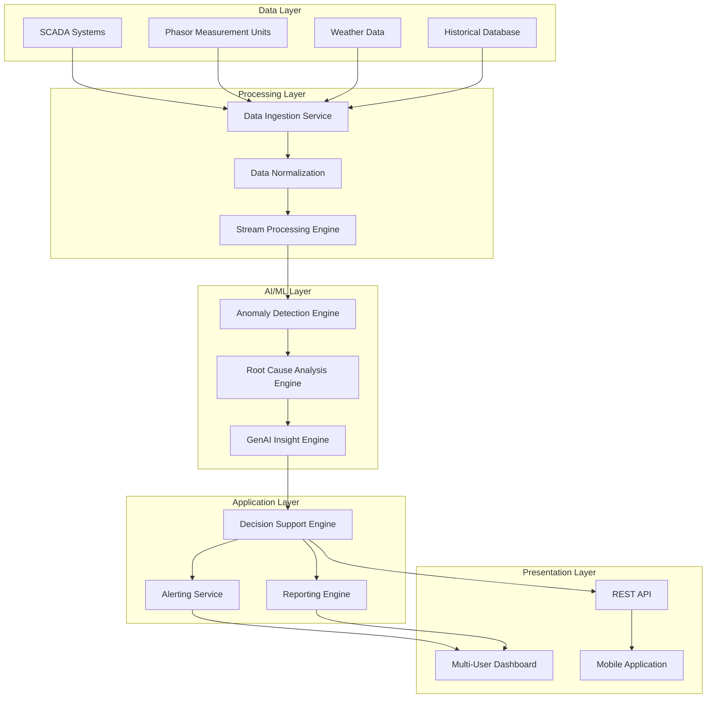

# Design Document: Rural Power Anomaly Detection System

## Overview

The Rural Power Anomaly Detection System is a comprehensive AI-powered solution that combines traditional machine learning for anomaly detection with generative AI for actionable insights. The system addresses the critical challenge of power supply inefficiencies in rural areas by providing real-time monitoring, root cause analysis, and human-readable recommendations for infrastructure managers, grid operators, and maintenance teams.

The system architecture follows a modular approach with three core components: a traditional ML-based Anomaly Detection Engine, a Root Cause Analysis Engine, and a GenAI-powered Insight Generation Engine. These components work together to process SCADA data, identify anomalies, determine root causes, and generate actionable recommendations in natural language.

## Architecture

The system follows a layered architecture with clear separation of concerns:



The architecture supports horizontal scaling through microservices deployment and uses event-driven communication between components. The system can be deployed on cloud infrastructure with auto-scaling capabilities to handle varying loads from multiple rural areas.

## Components and Interfaces

### Data Ingestion Service
**Purpose**: Collects and validates data from multiple sources including SCADA systems, PMUs, weather stations, and historical databases.

**Key Interfaces**:
- `ingestSCADAData(timestamp, measurements, source_id)`: Processes real-time SCADA measurements
- `validateDataQuality(data_batch)`: Ensures data integrity and flags quality issues
- `normalizeData(raw_data, source_type)`: Converts data to standardized format

**Implementation Notes**: Uses Apache Kafka for high-throughput data streaming and implements circuit breaker patterns for resilient data collection from unreliable rural network connections.

### Anomaly Detection Engine
**Purpose**: Implements traditional ML algorithms to identify unusual patterns in power transmission data using context-agnostic learning approaches.

**Key Interfaces**:
- `detectAnomalies(power_flow_data, context_metadata)`: Returns anomaly scores and classifications
- `updateModel(new_training_data)`: Continuously improves detection accuracy
- `classifySeverity(anomaly_data)`: Assigns severity levels (low, medium, high, critical)

**ML Approach**: Based on research findings, the system uses autoencoder neural networks for context-agnostic anomaly detection, similar to the GridCAL algorithm. The autoencoder maps power flow measurements to a low-dimensional latent space and identifies anomalies based on reconstruction error. This approach enables analysis of measurements from different grid contexts in an aggregate fashion.

### Root Cause Analysis Engine
**Purpose**: Analyzes detected anomalies to identify underlying causes using historical patterns, environmental factors, and equipment status.

**Key Interfaces**:
- `analyzeRootCause(anomaly_data, historical_context)`: Returns ranked list of potential causes
- `correlateWithEnvironmental(anomaly_timestamp, weather_data)`: Identifies weather-related causes
- `assessEquipmentHealth(equipment_id, maintenance_history)`: Evaluates equipment-related factors

**Analysis Approach**: Implements a multi-factor analysis combining statistical correlation, pattern matching, and rule-based reasoning to identify the most likely root causes with supporting evidence.

### GenAI Insight Engine
**Purpose**: Converts technical analysis results into human-readable insights and actionable recommendations using large language models.

**Key Interfaces**:
- `generateInsights(anomaly_data, root_causes, user_role)`: Produces role-specific explanations
- `createRecommendations(analysis_results, resource_constraints)`: Generates actionable steps
- `formatForAudience(technical_data, audience_type)`: Adapts language complexity

**GenAI Implementation**: Uses domain-specific fine-tuned language models for power grid maintenance, similar to the P2FT approach identified in research. The system maintains a knowledge base of power grid terminology and maintenance procedures to ensure accurate and relevant recommendations.

### Decision Support Engine
**Purpose**: Prioritizes issues, estimates costs and timeframes, and provides structured decision-making support.

**Key Interfaces**:
- `prioritizeIssues(issue_list, resource_availability)`: Returns prioritized action items
- `estimateResources(recommended_actions)`: Calculates cost, time, and personnel requirements
- `generateAlternatives(primary_recommendation)`: Provides alternative solutions with trade-offs

### Multi-User Dashboard
**Purpose**: Provides role-based interfaces for different user types with customized views and functionality.

**Key Interfaces**:
- `getDashboardConfig(user_role, permissions)`: Returns customized dashboard layout
- `generateReport(report_type, time_range, filters)`: Creates exportable reports
- `sendAlert(alert_data, recipient_list, channels)`: Distributes notifications

## Data Models

### PowerMeasurement
```
{
  timestamp: DateTime,
  source_id: String,
  voltage: Float,
  current: Float,
  frequency: Float,
  power_factor: Float,
  active_power: Float,
  reactive_power: Float,
  location: GeoCoordinate,
  quality_score: Float
}
```

### Anomaly
```
{
  id: UUID,
  timestamp: DateTime,
  severity: Enum[LOW, MEDIUM, HIGH, CRITICAL],
  confidence_score: Float,
  affected_equipment: List[String],
  measurement_data: PowerMeasurement,
  detection_method: String,
  status: Enum[DETECTED, ANALYZING, RESOLVED]
}
```

### RootCause
```
{
  id: UUID,
  anomaly_id: UUID,
  cause_type: Enum[EQUIPMENT_FAILURE, WEATHER, OVERLOAD, MAINTENANCE],
  likelihood: Float,
  evidence: List[String],
  affected_components: List[String],
  historical_occurrences: Integer
}
```

### ActionableInsight
```
{
  id: UUID,
  anomaly_id: UUID,
  target_audience: Enum[MANAGER, OPERATOR, TECHNICIAN],
  summary: String,
  detailed_explanation: String,
  recommendations: List[Recommendation],
  urgency: Enum[LOW, MEDIUM, HIGH, IMMEDIATE],
  generated_timestamp: DateTime
}
```

### Recommendation
```
{
  id: UUID,
  action_description: String,
  estimated_cost: Float,
  estimated_duration: Duration,
  required_resources: List[String],
  success_metrics: List[String],
  alternatives: List[AlternativeAction]
}
```

Now I need to use the prework tool to analyze the acceptance criteria before writing the Correctness Properties section:

## Correctness Properties

*A property is a characteristic or behavior that should hold true across all valid executions of a system—essentially, a formal statement about what the system should do. Properties serve as the bridge between human-readable specifications and machine-verifiable correctness guarantees.*

After analyzing the acceptance criteria, I identified several properties that can be consolidated to eliminate redundancy. For example, multiple properties about data completeness (timestamps, confidence scores, evidence, success metrics) can be combined into comprehensive completeness properties. Similarly, performance properties for different components can be unified where they test the same underlying behavior.

### Property 1: Anomaly Detection Performance
*For any* valid power transmission data, the anomaly detection analysis should complete within 30 seconds and produce results with all required fields (timestamp, confidence score, severity classification)
**Validates: Requirements 1.1, 1.2, 1.4**

### Property 2: Anomaly Classification Consistency
*For any* detected anomaly, the system should assign exactly one severity level from the defined set (low, medium, high, critical) and achieve at least 95% accuracy on known anomaly patterns
**Validates: Requirements 1.2, 1.5**

### Property 3: Multi-Anomaly Prioritization
*For any* set of simultaneously occurring anomalies, the system should prioritize them based on potential impact to power supply in descending order of severity
**Validates: Requirements 1.3**

### Property 4: Root Cause Analysis Completeness
*For any* detected anomaly, root cause analysis should complete within 60 seconds and produce results that include evidence from historical patterns, environmental factors, and equipment status, with causes ranked by likelihood and impact
**Validates: Requirements 2.1, 2.2, 2.3, 2.4, 2.5**

### Property 5: Insight Generation Quality
*For any* identified anomaly and root cause, the insight generator should produce human-readable explanations that include severity context, urgency information, and specific actionable recommendations, using language appropriate for the target audience
**Validates: Requirements 3.1, 3.2, 3.3, 3.4, 3.5**

### Property 6: Decision Support Completeness
*For any* completed analysis, the decision support engine should generate prioritized action items that include estimated costs, timeframes, resource requirements, and success metrics, considering available resources and constraints
**Validates: Requirements 4.1, 4.2, 4.4, 4.5**

### Property 7: Alternative Solutions Presentation
*For any* scenario where multiple solutions exist, the system should present alternatives with clearly explained trade-offs
**Validates: Requirements 4.3**

### Property 8: Critical Alert Response
*For any* critical anomaly detection, the system should send immediate alerts through multiple communication channels (email, SMS, dashboard) with preliminary analysis and recommended immediate actions
**Validates: Requirements 5.2, 5.3, 5.5**

### Property 9: Role-Based Alert Thresholds
*For any* user role, the system should apply appropriate alert thresholds and deliver alerts relevant to that role's responsibilities
**Validates: Requirements 5.4**

### Property 10: Trend Analysis Comprehensiveness
*For any* trend analysis request, the system should identify seasonal patterns, degradation trends, and recurring issues, and provide preventive measure recommendations
**Validates: Requirements 6.2, 6.5**

### Property 11: Historical Report Accuracy
*For any* requested time period, generated historical reports should cover exactly the specified timeframe and include predictive insights based on historical patterns
**Validates: Requirements 6.3, 6.4**

### Property 12: Role-Based Dashboard Customization
*For any* user role, the dashboard should display information relevant to their role and permissions, with appropriate customization options
**Validates: Requirements 7.1, 7.2**

### Property 13: Report Export Functionality
*For any* generated report, the system should support customization of content, format, and delivery schedule, and allow export in multiple formats (PDF, CSV, JSON)
**Validates: Requirements 7.3, 7.4**

### Property 14: Data Processing Resilience
*For any* incoming data from external systems, the system should validate and normalize it regardless of source format, handle data quality issues gracefully, and maintain complete data lineage and audit trails
**Validates: Requirements 8.2, 8.3, 8.4, 8.5**

### Property 15: System Performance Under Load
*For any* normal system load, data processing should complete within 30 seconds, and the system should handle up to 100 concurrent users without performance degradation
**Validates: Requirements 9.1, 9.3**

### Property 16: Auto-Scaling Performance Maintenance
*For any* increased system load, performance should be maintained through auto-scaling capabilities
**Validates: Requirements 9.2**

### Property 17: Resource Prioritization
*For any* resource-constrained scenario, the system should prioritize critical anomaly detection over non-urgent analysis tasks
**Validates: Requirements 9.4**

### Property 18: Security Implementation Completeness
*For any* data handling scenario, the system should encrypt data in transit and at rest using industry-standard encryption
**Validates: Requirements 10.1**

### Property 19: Authentication and Access Control
*For any* user access attempt, the system should require multi-factor authentication and implement role-based access control with principle of least privilege
**Validates: Requirements 10.2, 10.3**

### Property 20: Security Event Handling
*For any* security event occurrence, the system should log the event and alert security administrators appropriately
**Validates: Requirements 10.4**

## Error Handling

The system implements comprehensive error handling across all components to ensure resilience in rural infrastructure environments where network connectivity and data quality may be unreliable.

### Data Quality Issues
- **Invalid or corrupted SCADA data**: System validates incoming data and continues processing with available valid data while flagging quality issues
- **Missing sensor readings**: Uses interpolation and historical patterns to estimate missing values where appropriate
- **Network connectivity issues**: Implements retry mechanisms with exponential backoff and local caching for offline operation

### ML Model Failures
- **Anomaly detection model errors**: Falls back to rule-based detection methods and alerts administrators of model issues
- **Root cause analysis failures**: Provides partial analysis with available data and clearly indicates confidence levels
- **GenAI service unavailability**: Uses template-based reporting as fallback while maintaining core functionality

### System Resource Constraints
- **Memory or CPU limitations**: Implements graceful degradation by prioritizing critical functions and deferring non-urgent analysis
- **Storage capacity issues**: Implements data archiving and cleanup policies to maintain operational capacity
- **Concurrent user limits**: Implements queuing mechanisms and load balancing to handle peak usage

### Integration Failures
- **SCADA system disconnection**: Maintains local data buffers and continues analysis with cached data
- **External API failures**: Implements circuit breaker patterns and fallback mechanisms
- **Database connectivity issues**: Uses local caching and data replication for continued operation

## Testing Strategy

The testing strategy employs a dual approach combining unit testing for specific scenarios with property-based testing for comprehensive validation of system behaviors.

### Unit Testing Approach
Unit tests focus on specific examples, edge cases, and integration points:
- **Data validation edge cases**: Test handling of malformed SCADA data, extreme values, and missing fields
- **ML model integration**: Test model loading, prediction accuracy with known datasets, and error handling
- **GenAI prompt engineering**: Test insight generation with various input scenarios and audience types
- **Alert delivery mechanisms**: Test email, SMS, and dashboard notification systems
- **User authentication flows**: Test MFA implementation, session management, and access control

### Property-Based Testing Configuration
Property-based tests validate universal behaviors across all possible inputs:
- **Testing Framework**: Uses Hypothesis (Python) or fast-check (JavaScript/TypeScript) for property-based testing
- **Test Configuration**: Minimum 100 iterations per property test to ensure comprehensive input coverage
- **Test Tagging**: Each property test includes a comment referencing its design document property
- **Tag Format**: `# Feature: rural-power-anomaly-detection, Property {number}: {property_text}`

### Integration Testing
- **End-to-end data flow**: Test complete pipeline from SCADA data ingestion to dashboard display
- **Multi-user scenarios**: Test concurrent access, role-based permissions, and resource sharing
- **Performance testing**: Validate system performance under various load conditions
- **Disaster recovery**: Test system recovery from various failure scenarios

### Acceptance Testing
- **User role validation**: Test that each user type receives appropriate information and functionality
- **Regulatory compliance**: Validate security measures and data privacy implementations
- **Rural environment simulation**: Test system behavior under poor network conditions and intermittent connectivity

The testing strategy ensures that both individual components and the integrated system meet all requirements while maintaining reliability in challenging rural infrastructure environments.